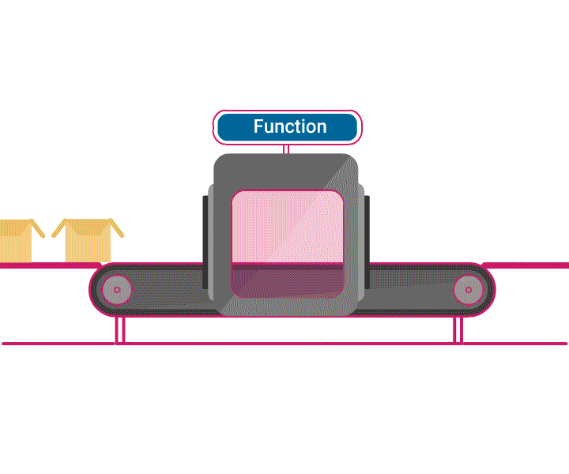
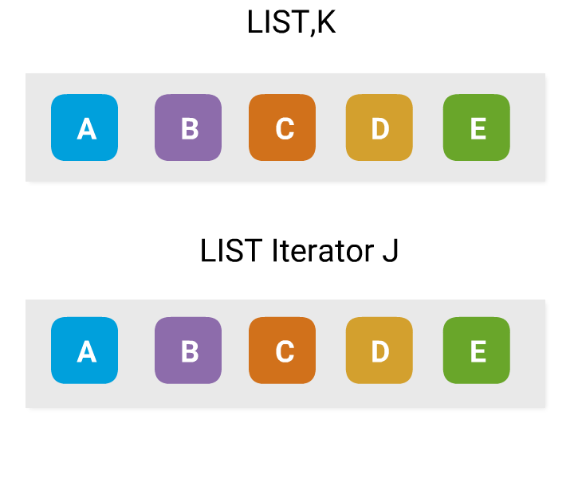
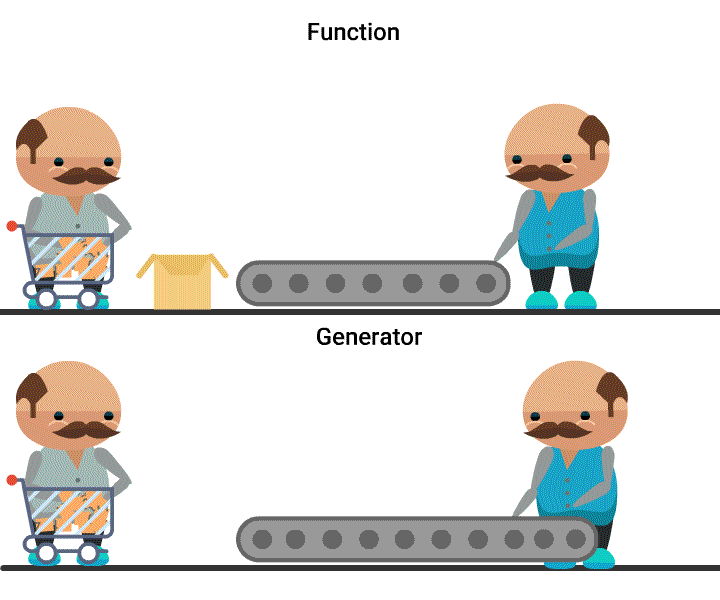

# Python3-Functions-and-OOPs

## Introduction
```
Welcome to the world of Pythonista! Let's jump into course now. This course covers:
    Functions
    List Comprehensions
    Iterators and Generators
    Classes and Objects in Python
    Closures and Decorators
    Descriptors and Properties
```


## Functions



- A function is a piece of code, capable of performing a similar task repeatedly.
- It is defined using def keyword in python.

### Syntax of a function :
```
def <function_name>(<parameter1>, <parameter2>, ...):
     'Function documentation'
     function_body
     return <value>         
```
- Parameters, return expression and documentation string are optional.

### Sample function - square
```
def square(x):
    'Returns square of a number.'
    return x**2
```

## Common Built-in Functions

There are many built-in functions Python offers. Here are some of them listed.
```
    len : Returns the length of an object.
        e.g : len('hello') -> 5

    type : Returns the type of an object.
        e.g : type([2,3]) -> <type list>

    range : Returns a iterator of a number sequence.

        e.g : list(range(10, 13)) -> [10, 11, 12]

        list(range(3)) -> [0, 1, 2]
```

  
## Iterators



- An Iterator is an object, which allows a programmer to traverse through all the elements of a collection, regardless of its specific implementation.
- Values of an Iterator can be accessed only once and in sequential order.

### Sample Iterator
```
x = [6, 3, 1]
s = iter(x)            
print(next(s))      # -> 6
print(next(s))      # -> 3
print(next(s))      # -> 1
print(next(s))      # -> StopIteration Error
```

## List Comprehensions

- Alternative to for loops.
- More concise, readable, efficient and mimic functional programming style.
- Used to:
    - Apply a method to all or specific elements of a list, and
    - Filter elements of a list satisfying specific criteria.

### Example
```
x = [6, 3, 1]
y = [ i**2 for i in x ]   # List Comprehension expression
print(y)                  # -> [36, 9, 1] 
```

## Generators


- A Generator object is an iterator, whose values are created at the time of accessing them.
- A generator can be obtained either from a generator expression or a generator function.

### Example
```
x = [6, 3, 1]
g = (i**2 for i in x)  # generator expression
print(next(g))         # -> 36
```

## Extending Built-in Types

Extending Built-in Types EmployeesList object can be used to store all employee objects, just by replacing statement all_employees = [] with all_employees = EmployeesList().

## Example 2
```
class Employee(Person):
    all_employees = EmployeesList()
    def __init__(self, fname, lname, empid):
        Person.__init__(self, fname, lname)
        self.empid = empid
        Employee.all_employees.append(self)

e1 = Employee('Jack', 'simmons', 456342)
e2 = Employee('George', 'Brown', 656721)
print(Employee.all_employees.search('or'))
```
### Output
```
​
['George']
​
```


